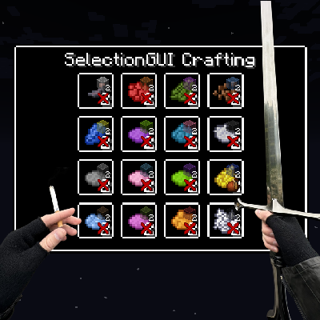

This is a fork of [Selection GUI Crafting](https://www.curseforge.com/minecraft/mc-mods/selection-gui-crafting) by [Gliese_832_c](https://www.curseforge.com/members/gliese_832_c). It provides a few improvements to the original mod and also adds support for [GroovyScript](https://www.curseforge.com/minecraft/mc-mods/groovyscript).

## Description
Minecraft 1.12.2 mod that gives modpack authors the ability to add crafting recipes into a selection GUI that is triggered by right-clicking while holding the right items.

This could, for example, be used for clay recipes. Instead of manually arranging clay balls in a different way in a crafting table, it would be possible to make it so that you right-click with a spatula in one hand, clay in the other, and just select the clay item you want to make.
Another use example would be forging. Right-click with a hammer in one hand, an ingot in the other, and select your desired toolhead.

## Fork? Rewrite!

What started as a fork of the original mod, quickly turned into a rewrite. The original crafting system felt way to clunky and not user-friendly. The new system is much more intuitive and user-friendly. It also allows much more customization and is more flexible to benefit the needs of modpack developers. An added bonus is the support for GroovyScript. The old CraftTweaker support was rewritten as well to reflect the new system.

## [Ender-Development](https://github.com/Ender-Development)

Our Team currently includes:
- `_MasterEnderman_` - Project-Manager, Developer
- `Klebestreifen` - Developer

You can contact us on our [Discord](https://discord.gg/JF7x2vG).

## Contributing
Feel free to contribute to the project. We are always happy about pull requests.
If you want to help us, you can find potential tasks in the [issue tracker](https://github.com/Ender-Development/PatchouliBooks/issues).
Of course, you can also create new issues if you find a bug or have a suggestion for a new feature.
Should you have any questions, feel free to ask us on [Discord](https://discord.gg/JF7x2vG).

## Partnership with Akliz

> It's a pleasure to be partnered with Akliz. Besides being a fantastic server provider, which makes it incredibly easy to set up a server of your choice, they help me to push myself and the quality of my projects to the next level. Furthermore, you can click on the banner below to get a discount. :')

If you aren't located in the [US](https://www.akliz.net/enderman), Akliz now offers servers in:

- [Europe](https://www.akliz.net/enderman-eu)
- [Oceania](https://www.akliz.net/enderman-oce)